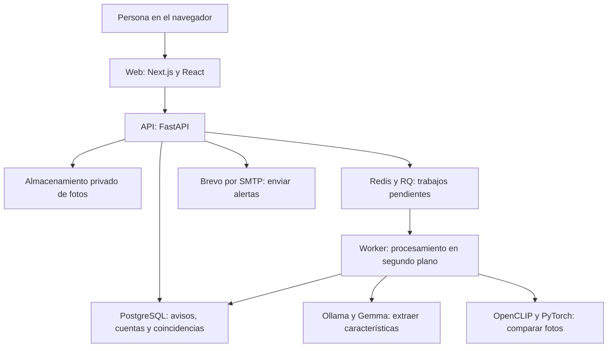

# Cómo funciona MascoMatch

Guía del proyecto al 9 de octubre de 2026. Describe las tecnologías elegidas y su uso concreto en este repositorio. La configuración de producción se encuentra en [production.md](production.md).

## La idea general

La página guarda avisos de animales perdidos y reportes de la comunidad. Cuando llega un avistamiento, busca avisos compatibles por características, ubicación, fecha y, cuando hay fotos y modelos habilitados, similitud visual. El dueño recibe una posible coincidencia para revisar. La decisión sobre la identidad del animal sigue siendo humana.

Hay tres partes principales:

1. **Web:** las pantallas y formularios que usa la persona.
2. **API:** las reglas del sistema, los permisos y las operaciones sobre los datos.
3. **Servicios de apoyo:** almacenamiento, procesamiento de IA, correo, respaldo y monitoreo.

El procesamiento de IA se habilita por configuración. La publicación de avisos funciona aunque esos modelos estén desactivados.

## Lo que ve el usuario

| Tecnología | Qué hace en MascoMatch | Ejemplo |
| --- | --- | --- |
| **React** | Construye componentes de la interfaz y actualiza su estado. | Cambiar de paso en el formulario sin perder lo escrito. |
| **Next.js** | Organiza páginas y ejecuta tanto la web como sus rutas de servidor. Es el marco sobre el que usamos React. | `/perdi`, `/perdidos`, `/mis-avisos` y los intermediarios que envían solicitudes a la API. |
| **TypeScript** | Agrega tipos al código JavaScript para detectar errores durante el desarrollo. | Avisar si un componente espera una fecha y recibe otro tipo de dato. |
| **Tailwind CSS y CSS** | Definen colores, tamaños, espacios y comportamiento del diseño en distintos tamaños de pantalla. | El formulario adaptable al celular y las tarjetas de animales perdidos. |
| **Node.js** | Ejecuta JavaScript del lado del servidor y las herramientas de construcción de la web. | Ejecutar el servidor de Next.js y compilar una versión para publicar. |
| **npm** | Instala las bibliotecas de la web y ejecuta sus comandos. | `npm ci`, `npm test` y `npm run build`. |

La web tiene rutas que actúan como intermediarias hacia la API. Por ejemplo, el navegador envía una publicación a `/api/backend/...`; Next.js agrega la sesión desde una cookie protegida y consulta FastAPI. El token no se devuelve al JavaScript de la interfaz.

## API y reglas del negocio

| Tecnología | Qué hace en MascoMatch |
| --- | --- |
| **Python** | Es el lenguaje de la API, los workers, el matching y los respaldos. |
| **FastAPI** | Define las operaciones disponibles: registrar una cuenta, publicar, consultar coincidencias, cerrar un aviso o moderar contenido. Comprueba el acceso a las rutas. |
| **Uvicorn** | Es el servidor que recibe solicitudes HTTP y ejecuta FastAPI. En producción se configuraron dos procesos de API. |
| **Pydantic** | Valida los datos que llegan y las respuestas. Evita aceptar campos con tipos, tamaños o valores inválidos. |
| **Pydantic Settings** | Lee la configuración del entorno y los archivos privados de secretos. Rechaza configuraciones de producción incompletas o inseguras. |
| **SQLAlchemy** | Expresa consultas y transacciones de la base desde Python. Permite guardar, por ejemplo, una observación junto con su trabajo pendiente. |
| **Psycopg** | Es el conector que comunica Python con PostgreSQL. SQLAlchemy lo utiliza; las operaciones de respaldo también. |
| **Alembic** | Mantiene la evolución de las tablas mediante migraciones numeradas. Actualiza una base existente conservando los datos. |

**API** significa una interfaz para que otro programa pida operaciones. No tiene que ser pública: muchas operaciones de MascoMatch requieren una cuenta y comprueban que el aviso pertenezca a esa persona.

## Dónde se guardan las cosas

| Tecnología | Qué guarda o calcula |
| --- | --- |
| **PostgreSQL** | Guarda cuentas, mascotas, avisos, avistamientos, trabajos, coincidencias, notificaciones, sesiones y auditoría. Es la fuente principal de datos. |
| **PostGIS** | Es una extensión de PostgreSQL para operaciones geográficas. Responde si un avistamiento está dentro de la zona de búsqueda de un aviso. |
| **pgvector** | Es una extensión de PostgreSQL para vectores numéricos. Guarda las representaciones de las fotos y permite comparar su distancia coseno. |
| **MinIO** | Guarda archivos de fotos en la instalación local existente. Las fotos se mantienen privadas. |
| **SeaweedFS** | Es el almacenamiento de fotos elegido para el despliegue nuevo de producción. Su configuración conserva versiones y separa credenciales de aplicación, visión y administración. |
| **S3** | Es la interfaz que usa el código para guardar y leer objetos. MinIO y SeaweedFS la implementan; usar esa interfaz no implica contratar Amazon AWS. |
| **Boto3** | Es la biblioteca Python que hace las operaciones S3. La configuramos para conectarse al almacenamiento del proyecto. |
| **Pillow** | Valida y procesa las imágenes: corrige orientación, reduce dimensiones y elimina metadatos EXIF antes de guardarlas. |

La base conserva una referencia a cada foto; el archivo de imagen está en el almacenamiento de objetos. Por eso un respaldo completo necesita tanto PostgreSQL como las fotos.

## Procesamiento en segundo plano

| Tecnología o componente | Qué hace |
| --- | --- |
| **Redis** | Mantiene la cola de trabajos. En producción también guarda contadores compartidos de solicitudes, permisos temporales para subir fotos y algunas métricas. |
| **RQ** | Organiza los trabajos Python utilizando Redis. Los entrega al worker y administra su ejecución. |
| **Worker** | Es un proceso separado que ejecuta tareas lentas, como analizar una descripción o calcular un vector visual. Es una función del sistema, no un proveedor externo. |

La solicitud de publicación guarda el reporte y un trabajo pendiente en PostgreSQL. Un despachador entrega ese trabajo a Redis/RQ. Esto permite retomar el trabajo si Redis estuvo caído al publicar. El formulario no espera a que termine una inferencia de IA.

Los límites en Redis también permiten que los dos procesos de API respeten el mismo contador. Un límite guardado solo en la memoria de un proceso no se compartiría con el otro.

## IA: dos tareas distintas

| Tecnología | Qué hace en este proyecto |
| --- | --- |
| **Ollama** | Ejecuta el modelo generativo dentro del equipo o servidor del proyecto. No es el modelo en sí: es el servicio que lo carga y recibe las consultas. |
| **Gemma 3, variante 4B** | Es el modelo elegido para extraer características físicas de descripciones y fotos, como color o tipo de pelaje. Su salida se valida antes de guardarla. |
| **OpenCLIP, ViT-B-32** | Convierte cada foto en una representación de 512 números que permite medir similitud visual. |
| **PyTorch y Torchvision** | Ejecutan las redes y las transformaciones de imágenes que utiliza OpenCLIP. |

Un **embedding** es esa lista de números que representa una imagen. Dos fotos parecidas pueden producir vectores cercanos. El sistema combina esa señal con características, distancia y fecha; no identifica automáticamente a una mascota solo porque dos fotos se parezcan.

Los pesos CLIP llamados `openai` son archivos de modelo descargados para ejecución local; no usamos una API de OpenAI ni una clave de pago para esta tarea. La inferencia de Gemma y CLIP se realiza en nuestra infraestructura. Si se despliega en un servidor contratado, ese servidor sigue teniendo un costo.

Los umbrales actuales son iniciales. Hay un evaluador para fotografías etiquetadas, pero todavía falta reunir suficientes ejemplos reales y calibrar el sistema. Una puntuación de compatibilidad no expresa una probabilidad comprobada de que sea el mismo animal.

## Ubicaciones y mapas

| Tecnología | Qué hace |
| --- | --- |
| **Geolocalización del navegador** | Obtiene una referencia del dispositivo cuando la persona concede permiso. Permite ubicar el pin o priorizar sugerencias cercanas. |
| **Photon** | Busca direcciones, barrios o lugares a partir de lo que escribe el usuario y permite consultar una ubicación en sentido inverso. |
| **OpenStreetMap** | Aporta datos geográficos y la cartografía utilizada en el mapa. |
| **Leaflet** | Dibuja el mapa interactivo en la página y permite mover el pin. |

Photon utiliza un servicio externo configurable; la búsqueda envía el texto y, cuando se usa cercanía, una referencia geográfica. La inferencia de IA permanece local. Las coordenadas precisas se conservan internamente para comparar reportes; las vistas públicas usan ubicaciones aproximadas.

## Correo y seguridad

| Tecnología o mecanismo | Qué hace |
| --- | --- |
| **SMTP y Brevo** | SMTP es el protocolo de envío. Brevo es el servicio que aceptará los mensajes para confirmación de correo, recuperación y avisos de posibles coincidencias. La integración está escrita; falta terminar su configuración y probar entrega real. |
| **Mailpit** | Recibe correos de prueba en un entorno local para inspeccionarlos sin enviarlos a destinatarios reales. |
| **JWT y PyJWT** | El token firmado identifica la cuenta y la sesión. La API verifica la firma, vencimiento y registro de sesión vigente en PostgreSQL. |
| **Cookie HttpOnly** | Guarda la sesión del navegador sin exponer el token al JavaScript de la interfaz. En producción utiliza además `Secure`, `SameSite=Lax` y el prefijo `__Host-`. |
| **PBKDF2 SHA-256** | Produce un hash de la contraseña con sal aleatoria y 600.000 iteraciones. La contraseña no se guarda como texto legible. |
| **AES-256-GCM y cryptography** | Cifran y autentican los respaldos. Los enlaces de cuenta también tienen una copia cifrada para el envío y un hash para su validación. |
| **Secretos de Docker Compose** | Montan claves privadas en archivos de los servicios que las necesitan. No se incluyen en el repositorio ni en el código de la web. |

La clave SMTP sigue siendo privada en el backend, aunque Brevo sea gratuito. Las cuentas necesitan confirmar su correo para recibir alertas externas en producción. Cambiar la contraseña revoca todas sus sesiones; cerrar sesión revoca la sesión correspondiente.

## Publicación, mantenimiento y desarrollo

| Tecnología | Qué hace |
| --- | --- |
| **Docker** | Empaqueta cada servicio con sus dependencias para ejecutarlo en contenedores. Las imágenes de API, web y worker usan un usuario sin privilegios. |
| **Docker Compose** | Define los servicios, redes, secretos y volúmenes y organiza su inicio. Hay archivos separados para desarrollo local y producción. |
| **Caddy** | Es la entrada del sitio en producción: recibe tráfico del dominio, administra HTTPS y lo dirige a la web o a lecturas públicas permitidas de la API. Su activación depende del servidor y DNS. |
| **Prometheus** | Consulta métricas privadas y evalúa alertas de disponibilidad, trabajos demorados, fallos de correo y respaldos atrasados. Falta elegir dónde recibir los avisos operativos. |
| **Git** | Conserva el historial de cambios del código mediante commits. |
| **GitHub** | Aloja el repositorio y permite compartir o revisar ese historial. |
| **GitHub Actions** | Ejecuta automáticamente las comprobaciones de API y web, la compilación y las auditorías de dependencias con cada actualización de `main`. |
| **pytest, pruebas de Node.js y TypeScript** | Comprueban comportamiento y tipos durante el desarrollo. Las pruebas comunes utilizan bases temporales y modelos simulados; las integraciones se activan por separado. |
| **SQLite** | Proporciona la base temporal de las pruebas comunes para que no modifiquen PostgreSQL ni los avisos reales. Las integraciones comprueban PostgreSQL por separado. |
| **pip-audit y npm audit** | Revisan si las dependencias tienen vulnerabilidades conocidas. Un resultado limpio es una comprobación puntual, no una garantía completa de seguridad. |
| **pg_dump y pg_restore** | Exportan y recuperan PostgreSQL. El sistema agrega fotos, hashes y cifrado para producir un respaldo completo. |

**Dominio, DNS y hosting son piezas distintas:** `mascomatch.com` es el nombre comprado; DNS debe apuntar ese nombre al servidor; el hosting es el equipo donde correrán los servicios. El repositorio por sí solo no publica el sitio.

## Ejemplo completo

1. Una persona publica a Kobe como perdido. React muestra el formulario; Next.js envía los datos a FastAPI con la sesión protegida.
2. FastAPI valida y guarda el animal y el aviso en PostgreSQL. Pillow limpia la foto y la guarda en el almacenamiento privado.
3. Si está habilitada la IA, Redis/RQ entrega trabajos al worker. Gemma propone características; CLIP genera un vector visual. Los resultados se guardan asociados a la evidencia vigente.
4. Otra persona informa un avistamiento. Si entra desde la ficha de Kobe, usa el formulario breve vinculado. Si es general, el sistema busca avisos compatibles por especie, zona y fecha.
5. PostGIS ayuda a filtrar por distancia; pgvector compara las representaciones de fotos disponibles; el código de matching combina esas señales y explica los motivos.
6. El dueño ve una posible coincidencia en sus notificaciones. Si corresponde una alerta por correo y su dirección está confirmada, la API la envía mediante Brevo.
7. El dueño revisa fotos y ubicación y responde si podría ser, no es o está confirmado. Puede marcar el animal como encontrado desde sus avisos.
8. Los respaldos permiten recuperar datos y fotos; las métricas ayudan al operador a detectar fallos o demoras.

## Ubicación del código

- `apps/web/`: páginas, formularios, mapas y rutas de servidor de la web.
- `apps/api/app/routers/`: operaciones de la API y permisos.
- `apps/api/app/models.py`: estructura de los datos.
- `apps/api/migrations/`: cambios numerados de la base.
- `apps/api/app/analysis/` y `embeddings/`: extracción y representaciones visuales.
- `apps/api/app/matching/`: reglas, ranking y evaluación.
- `apps/api/app/notifications/` y `account_mail.py`: mensajes y entrega de correo.
- `apps/api/app/ops/`: preparación de servicios, respaldos y recuperación.
- `infrastructure/production/`, `compose.production.yml` y `tools/production_init.py`: configuración del servidor.

Las bibliotecas auxiliares que aparecen en los archivos de dependencias sostienen estas funciones. Por ejemplo, NumPy maneja cálculos numéricos, HTTPX2 las consultas HTTP de Python y Botocore las operaciones de Boto3; no son servicios adicionales que haya que contratar.
